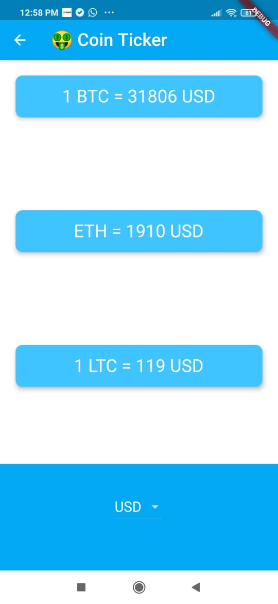
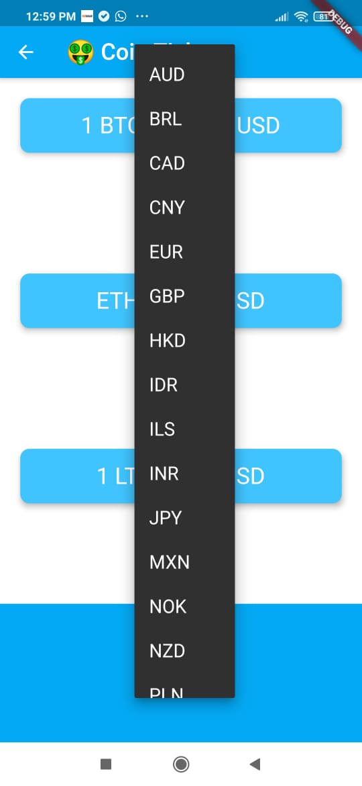
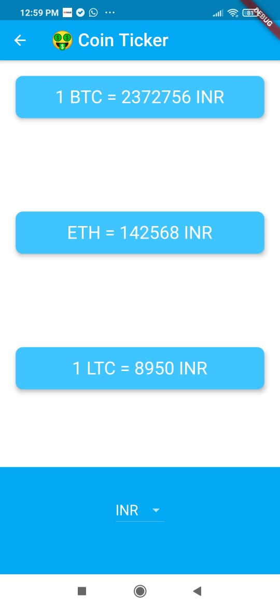

# Bitcoin Ticker 🤑

Built a crypto currency price chacking app, using flutter. It helps to monitor bitcoin investments on the move.

## Features
- Nomics Cryptocurrency API to convert BTC value to selected currency.
- DropdownButton Widget from Material design.
- Cupertino Widgets.

## Screenshots

### Value of BTC, ETH and LTC in USD

### Drop down list to select the currency in which you want to get the value of BTC

### Value of BTC, ETH and LTC in INR
